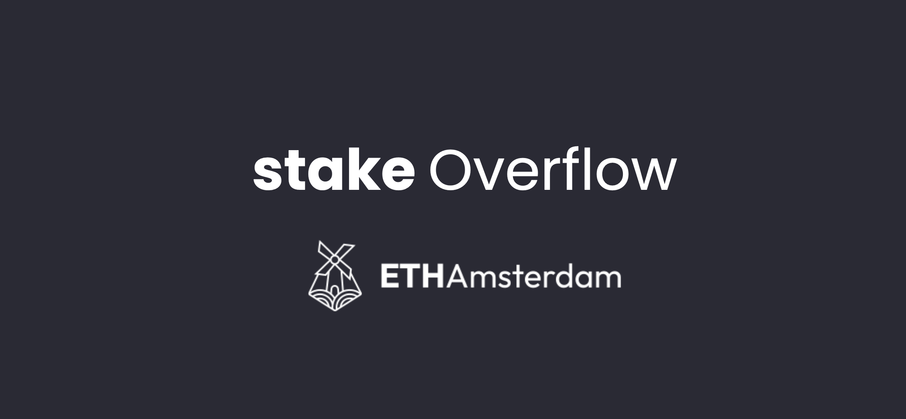

# StakeOverflow

StakeOverflow is a project that has a lot of moving parts - namely, the front-end interface that the users can use to interact with the platform (post and answer questions). The backend of the platform utilizes IPFS for data storage, and The Graph as a query service, on top of Polygon Edge - a private blockchain layer. Users who post questions stake funds as part of a "bounty" pool for potential answers. Other users on the platform can also join in to this bounty, and distribute rewards for answers that they found useful. Users are incentivized to answer questions, and to pick answers from the community, as they also have a stake in securing their funds. The users who have the best answers are directly rewarded from the bounty pool. Additionally, there are several mechanisms to protect from malicious users on the platform, such as fund lock-in and reward distribution schemes.

The majority of the logic is written in Solidity, and deployed locally on the chain. We benefited from using these technologies by making the platform as decentralized and censorship-resistant as possible. It allowed us to have a finer control over the overall architecture of the entire system, and control every aspect of it.

Produced at [ETHAmsterdam](https://showcase.ethglobal.com/ethamsterdam/stakeoverflow-c1ukj), by the engineers @ [Trapesys](https://trapesys.io).